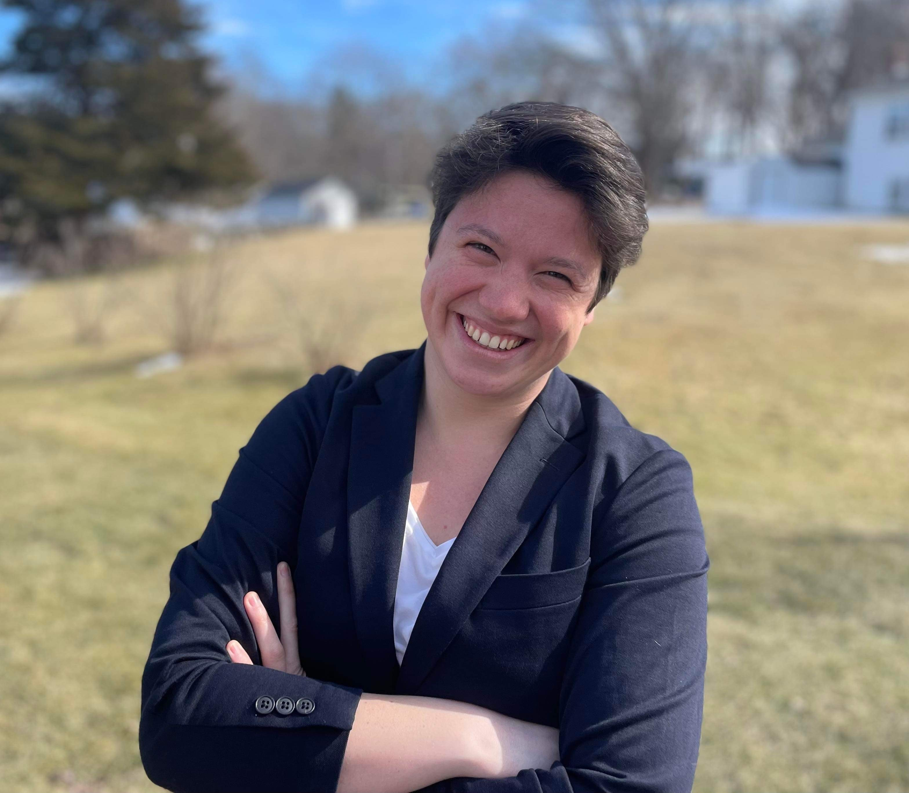

**My research focuses on the use of omic analysis and mathematical models to study photorespiration in plants.** 

I first began research as an undergraduate at Cornell University, working with Georg Jander at the Boyce Thompson Institute in Ithaca, NY. While pursuing a bachelor of arts in biochemistry, I worked in the lab and greenhouse on characterizing mutants in the benzoxazinoid pathway in maize, and characterizing pesticide uptake across maize inbred lines for my undergraduate honors thesis. However, during a summer NSF Research Experience for Undergraduates working with Dr. Bob VanBuren at Michigan State University on the genomics of facultative Crassulacean acid metabolism in succulents, I was bitten by the programming bug. Returning to school my senior year, I took computer science classes and applied to graduate school in plant biology. As a graduate student, I was a member of the [HAAIL](https://labs.ghassemi.xyz/) and [VanBuren](https://www.canr.msu.edu/people/dr_robert_vanburen) labs at Michigan State University (MSU), where I focused on applications of natural language processing in the plant sciences. My dissertation work focused on bibliometrics of desiccation tolerance research and using NLP to automate the generation of scientific hypotheses about the mechanisms of desiccation tolerance. Since graduating in 2024, I've started a postdoc in the [Walker Lab](https://berkleywalker.org/) at the [MSU-DOE Plant Research Laboratory](https://prl.natsci.msu.edu/), where I work on using omic data and metabolic flux modeling to study the biological process of photorespiration.  

Alongside my degree in biochemistry, I also pursued Spanish language education throughout my undergraduate career. After a year and a half living in Cornell University’s [Language House](https://cornell.campusgroups.com/culh/home/), several undergraduate immersion courses, and a semester studying abroad in Sevilla, Spain with the [CASA Sevilla program](https://casa.education/sevilla), I am proudly fluent in Spanish. I am always looking for opportunities to merge my dual academic interests, and in the past have participated in internship and coursework experiences in conservation biology ([The Ara Project](https://en.wikipedia.org/wiki/The_Ara_Project), Punta Islita, Costa Rica) and plant molecular diagnostics ([multi-semester course](https://classes.cornell.edu/browse/roster/FA18/class/PLSCI/4300) with a component in Santiago de Chile) that combined scientific learning and teaching with immersive Spanish language experiences. As a graduate student, I presented my work in Spanish at a virtual conference hosted by la Universidad de Valencia, and was selected as a semi-finalist in the Fulbright U.S. Student Program's Chile Science Initiative.   

I’m proudly [#BiInSci](https://twitter.com/hashtag/biinsci?ref_src=twsrc%5Egoogle%7Ctwcamp%5Eserp%7Ctwgr%5Ehashtag) and passionate about diversity and inclusion in the workplace. I volunteered at [Out for Undergrad Engineering](https://www.outforundergrad.org/engineering) in 2020 as a mentor to queer engineering undergraduates, and have since joined the year-round mentorship program. At my own institution, I worked with a team of queer graduate students and the [Gender and Sexuality Campus Center](https://lbgtrc.msu.edu/) to restart QT-Grad, an organization for queer graduate students across the university, and served as the president of the organization for its first year.  Beyond LGBTQ+-specific DEI work, I was a founding member of the Plant Biology Peer Mentorship Committee, whereI worked in a team of 3 to design and implement a new peer mentorship program for incoming students in our department. We designed this program specifically bearing in mind the outsized attrition of underrepresented minority (URM) and queer graduate students from our program compared to their representation in the department, and have completed several successful years of the program. By extension, I also helped the Computational Mathematics, Science and Engineering Department’s DEI committee adapt our program materials for their own implementation of a peer mentorship program.  

In my spare time, I love ballet, being outdoors, learning languages, and science fiction. The photos on this site are ones I’ve taken! I split my free time between doing ballet, reading books, learning languages, and most recently, learning to play the fiddle.  

Updated: 13 January 2025
