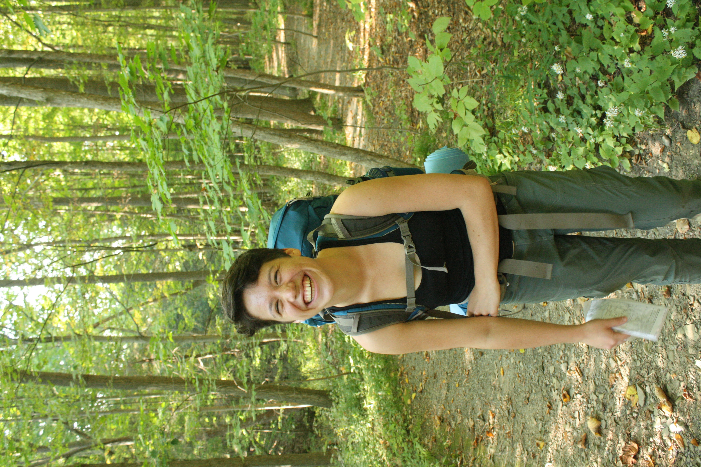

**My research focuses on the application of cutting-edge artificial intelligence methods in plant biology, with the aim of improving human life and sustainability.** 

I first began research as an undergraduate at Cornell University, working with Georg Jander at the Boyce Thompson Institute in Ithaca, NY. While pursuing a bachelor of arts in biochemistry, I worked in the lab and greenhouse on characterizing mutants in the benzoxazinoid pathway in maize, and characterizing pesticide uptake across maize inbred lines for my undergraduate honors thesis. However, during a summer NSF Research Experience for Undergraduates working with Robert VanBuren at Michigan State University on the genomics of facultative Crassulacean acid metabolism in succulents, I was bitten by the programming bug. Returning to school my senior year, I took computer science classes and applied to graduate school in plant biology. I’ve since joined the [Shiu Lab](https://shiulab.github.io/) at Michigan State, where I work on applications of machine learning interpretability and natural language processing in the plant sciences - check out the [projects](https://serenalotreck.github.io/projects/) page for more info on active projects. I hope to pursue a career in which I am able to use applications of machine learning to improve sustainability and security in agriculture or biofuel feedstocks, whether that be through genetics and breeding, or plant-science specific information extraction. 

Alongside my degree in biochemistry, I also pursued Spanish language throughout my undergraduate career. After a year and a half living in Cornell University’s [Language House](https://cornell.campusgroups.com/culh/home/), several undergraduate immersion courses, and a semester studying abroad in Sevilla, Spain with the [CASA Sevilla program](https://casa.education/sevilla), I am proudly fluent in the Spanish language. I am always looking for opportunities to merge my dual academic interests, and in the past have participated in internship and coursework experiences in conservation biology ([The Ara Project](https://en.wikipedia.org/wiki/The_Ara_Project), Punta Islita, Costa Rica) and plant molecular diagnostics ([multi-semester course](https://classes.cornell.edu/browse/roster/FA18/class/PLSCI/4300) with a component in Santiago de Chile) that combined scientific learning and teaching with immersive Spanish language experiences. I continue to search for academic and professional opportunities that will allow me to combine my work with my second language, such as industry internships and positions abroad.  

I’m proudly [#BiInSci](https://twitter.com/hashtag/biinsci?ref_src=twsrc%5Egoogle%7Ctwcamp%5Eserp%7Ctwgr%5Ehashtag) and passionate about diversity and inclusion in the workplace. I volunteered at [Out for Undergrad Engineering](https://www.outforundergrad.org/engineering) in 2020 as a mentor to queer engineering undergraduates. At my own institution, I have worked with a team of queer graduate students and the [LGBT Resource Center](https://lbgtrc.msu.edu/) to restart QT-Grad, an organization for queer graduate students across the university, and am currently the president of the organization.  Beyond LGBTQ+-specific DEI work, I am a member of the Plant Biology Peer Mentorship Committee. In this position, I have worked in a team of 3 to design and implement a new peer mentorship program for incoming students in our department. We have designed this program specifically bearing in mind the outsized attrition of underrepresented minority (URM) and queer graduate students from our program compared to their representation in the department, and have recently completed a successful first year of the program. In the first year I was a mentor to two students, and am continuing as a mentor in the coming year. I have also helped the Computational Mathematics, Science and Engineering Department’s DEI committee adapt our program materials for their own implementation of a peer mentorship program.  

*Anti-racism statement:* I recognize that I have unwittingly benefitted from systems of racism and oppression in the US, and am working to educate myself and become an effective co-conspirator against anti-Black racism.   

In my spare time, I love rock climbing, backpacking, running, dance, photography, and science fiction. The photos on all the pages on this site are ones I’ve taken! I split my free time between my sports, taking pictures, reading books and learning new languages.  

Updated: 24 May 2021

